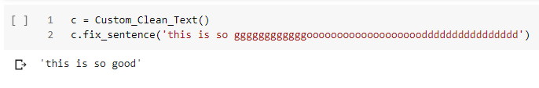

# CustomCleanText
## A utility file for my own experiments in NLP. This is a text cleaning python file.

## Packages Used:
<li> clean-text
<li> unidecode
<li> ftfy
<li> emoji
<li> autocorrect
<li> beautifulSoup

## What can it do?
<li> Removes HTML tags if present
<li> Converts the emojis to text based phrases
<li> Unicode fixing with the option to change the encoding type
<li> Converts into lower case
<li> Tokenizing special items Eg. '$' is converted to &lt;currency&gt;
<li> Can retain only characters
<li> Normalizes text like 'gggggggggggggooooooooooooooooooooooooooooooddddddddddddddddddd' to good

<b> Input Params </b>
  <ol> 
  <li> lower:boolean - convert the sentece to lower case. Default is False.
  <li> unicode:String - Accepted unicode encoding/decoding params 'NFC' ,'NFD', 'NFKC', 'NFKD'. Default is NFKD.
  <li> to_ascii:boolean - Convert special characters to the closest approximation of ascii representation. Default is False.
  <li> retain_characters_only:boolean - No numbers and special characters allowed. Default is False.
  <li> tokenize_spl_items:boolean - Replace URL, Phone number, number, currency and email with special tokens. Default is False
  </ol>
<b> Output </b>
  <ol>
  <li> Returns the cleaned string
  </ol>  

## Output

